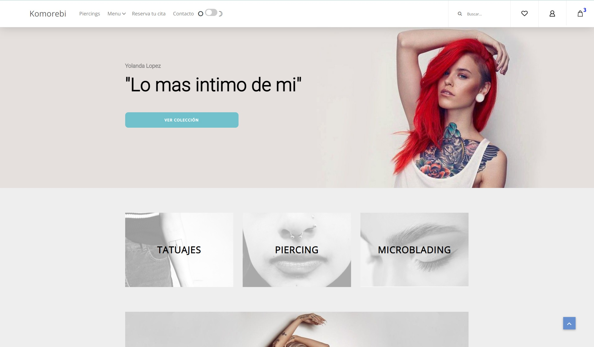
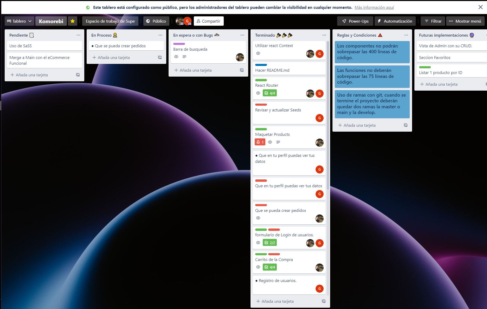

#eCommerce React Website (KOMOREBI)



<div align:center style="text-align:center"></div>

This is a real eCommerce website for a tattoo and piercing shop.

## Getting Started

Well, just visit the website at [komorebi-alpha.vercel.app](https://komorebi-alpha.vercel.app/) and get yurself a cool earring!

### Q&A

We have used Trello as a work control tool and to report failures and bugs in the code. It is a good tool, especially because it is free and allows us to do our work, in good conditions.



We have also used Selenium for automatic tests and page stress tests. Here I leave a sample of what this application is capable of.


### You want to own this website?

On the other hand if you'd like to host this website on your local machine just clone this repository with `git clone https://github.com/Dubesor22/ecommerce-react-node.git`. just copy and paste that command on your terminal, then write `npm init && npm install` to install all dependencies, and start a local server with `npm start`. That's it.

## Deployment

This website it's been deployed and made available to the public thanks to [Vercel](https://vercel.com), which is a completely free hosting.

## Built With

- [React.js](https://reactjs.org/) - Your favourite framework!
- [CSS](https://www.w3.org/Style/CSS/Overview.en.html) - A simple mechanism for adding style (e.g., fonts, colors, spacing) to Web documents.
- [HTML](https://html.com/) - Your Markup Languaje
- [Axios](https://axios-http.com/) - Fetch, APIS.
- [React Router v6](https://reactrouter.com/) - When you just want to take the easy route.
- [React Context](https://reactjs.org/docs/context.html) - A way to share values like these between components without having to explicitly pass a prop through every level of the tree.
- [SQL](https://blog.schauderhaft.de/2010/02/15/why-sql-sucks/) - Your favourite Structured Query Language.
- [MySql2](https://www.mysql.com/) - Create high-performance and scalable Online Transaction Processing (OLTP) applications.
- [Sequelize](https://html.com/) - A modern TypeScript and Node.js ORM for Postgres, MySQL, MariaDB, SQLite and SQL Server, and more.


## API

The API we make the calls to is the one we built in a previous MySQL-based project using Sequelize. All information about the API can be found here:

```
https://github.com/Dubesor22/eCommerce-backEnd
```

## Contributing

Like, share, subscribe, follow and join my Patreon! Just kidding this is totally for free.

## Authors

- **David Ubeda, aka Dubesor, your second favorite web developer.** - _Initial work_ - [Dubesor22](https://github.com/Dubesor22)

## Contributors

- **Gabriel Clemente, aka Gabo, your favorite web developer.** - _Added components and fixes_ - [Gabo](https://github.com/Gabo-Tech)


Maybe it's you.

## License

This project is licensed under the Creative Commons Public Domain License - Feel free to copy the code, I did it too.


